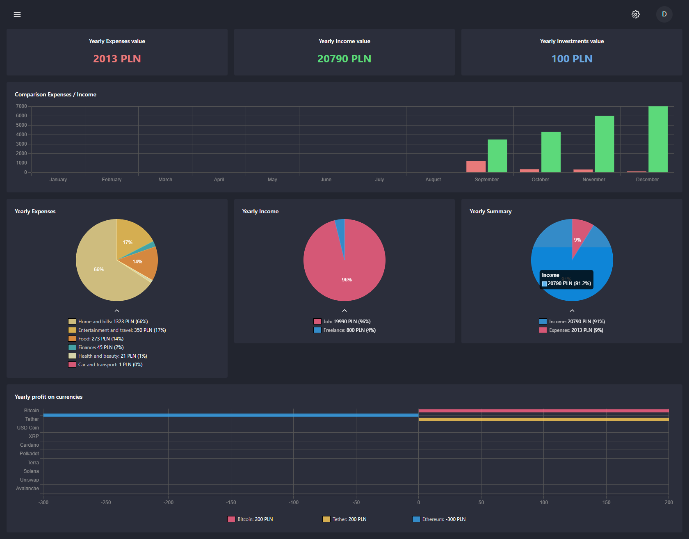

# 💰 Expenses App 💰

## Table of contents

- ℹ️ [General info](#ℹ️-general-info)
- 🎉[Project overview](#-project-overview)
- 📖 [What I learned during this project?](#-what-i-learned-during-this-project)
- ⚙️ [Technologies](#️-technologies-used-in-project)
- 📷 [Project functionalities and screenshots](#-project-functionalities-and-screenshots)
- 🔴 [Live](#-live)

## ℹ️ General info

The expenses app was created to help people control their finances. The app is writed on next.js + Typescript + Firebase Auth + Firestorage.

## 🎉 Project Overview

The project a homepage, authentication, and dashboard with applications. It will help you with tracking your finances. After authentification, the user can move around the dashboard, where expenses / income / investments / reminders can be added. The project I created took me about 2 months. I created it in my free time after coming home from my actual job.

## 📖 What I learned during this project?

During this project, I used Context API for the state management of my application. Statistics are handled by charts. I had many difficulties in this project, but it not discouraged me. The most difficult problem that I had, was creating a generic Form, which I can easily connect in templates without a compound with a react-hook-form controller. One of the others difficulties was creating logic in ContextAPI for updating data in user DB. The next problem that I encountered was customizing the react table, to create a CRUD table with it.

## ⚙️ Technologies used in project:

| Tech                                                    | Description                                                                                                                       |
| ------------------------------------------------------- | --------------------------------------------------------------------------------------------------------------------------------- | 
| [Next.js](https://nextjs.org/)                          | Next.js is a flexible React framework that gives you building blocks to create fast web applications.                             |
| [React](https://reactjs.org/)                           | A JavaScript library for building user interfaces                                                                                 |
| [Typescript](https://www.typescriptlang.org/)           | Javascript superset language                                                                                                      |
| [Sass](https://sass-lang.com/)                          | Css extension                                                                                                                     |
| [Cypress](https://www.cypress.io/)                      | Cypress is a purely JavaScript-based front-end testing tool built for the modern web.                                             |
| [Firebase](https://github.com/firebase/firebase-js-sdk) | The Firebase JavaScript SDK implements the client-side libraries used by applications using Firebase services.                    |     |
| [React-hook-form](https://react-hook-form.com/)         | React Hook Form is a library that helps validate forms in React.                                                                  |
| [Yup](https://github.com/jquense/yup)                   | Yup is a schema builder for runtime value parsing and validation.                                                                 |
| [Chart.js](https://www.chartjs.org/)                    | Chart.js is a Javascript library that allows designers and developers to draw all kinds of charts using the HTML5 canvas element. |

## 📷 Project functionalities and screenshots

- Dashboard -> You can see your statistics about the actual month and move to other months by navigating at top of the page.

    

- Expenses -> You can add your expenses with a specified date, category, name of expense, value, and description. Later you can edit or delete expenses.

    

    

- Income -> You can add income with specified data, category, title, income value, and description. There are buttons for editing or deleting too.
- Investments -> You can add crypto investment for the 20 most popular cryptocurrencies. In active investments, you will see what profit/loss can you pay out (it will count toward statistics). After the payout, you can edit your investment with the correct payout value (the program will calculate payout exchange by your payout value) or you can roll back the investment to still active if it wasn't done by purpose. While it's active, you can delete it.

    

- Reminders -> You can add a reminder of future bills to your account. It will remind you if the date of the event will be in past. Then will be modal, where you can add a reminder to your expenses or dismiss it. If you picked recursive, reminders will go to the next date. On the reminders page, you will have a calendar, which will show all the events. If you click on an event, the edit modal will show. That's space where you can edit or delete the reminder.

    

- Goals -> You can calculate the time to achieve a savings goal by your average of savings from your statistics.
- Statistics -> You can track your money flow by daily, monthly, and yearly statistics. On that page, you can see your charts with legends and percentage expenses for all user categories.

    

## 🔴 Live

https://expenses-app-nine.vercel.app/
